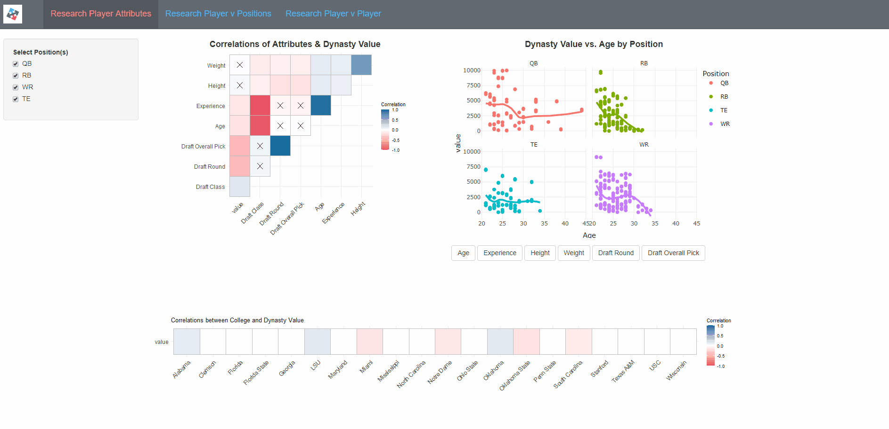

# Armchair Scouting: Using KeepTradeCut to Track Dynasty Fantasy Football Player Values

## Table of Contents

- [Motivation](#Motivation)
- [Technologies](#Technologies)
- [Data Questions](#Data-Questions)
- [The Process (in which We Trust)](#The-Process-in-which-We-Trust)
- [Link to the Dashboard](#Link-to-the-Dashboard)

## Motivation
 

   
Here's why I studied this

   I’ve kept up with sports for most of my life. As a kid, I used to wake up an hour earlier than I needed to so I could watch a full hour of Sportscenter. I wanted to hear Stuart Scott say things like, “As cool as the other side of the pillow,” and I wanted a fresh stack of stats to share with friends on the playground at school. As I got older, I found that fantasy sports, on top of being an excellent way to keep up with family and friends, offer a special outlet for sports fans, who tend to consume more statistics than the average person: fantasy sports allow sports fans to apply their sports knowledge to *decisions*. The questions of how we make decisions and how we determine value are at the pulse of fantasy sports’ intrigue.

  Fantasy football is the most popular fantasy sport. Most fantasy managers play in *redraft* leagues, where each manager drafts a new team of players every year. Those players acquire fantasy points for accomplishing various in-game feats in their real-life games each week (yards gained by catching or running or throwing, touchdowns caught or run or thrown, field goals kicked, or any number of other options). A manager’s team competes head-to-head against some other manager’s team each week, and the team that scores the most total points wins that week’s matchup. Just as in the NFL, you try to make the playoffs, and then you try to win every match in the playoffs to be that season’s champion.

  *Dynasty* leagues add an additional wrinkle to the structure described above. Instead of getting a new team every year, a manager’s team carries over year to year, and the manager only drafts incoming rookies to add to their team—much like real NFL teams do. This adds a dimension of time and player development to fantasy that redraft leagues simply don’t have. This dimension of time allows managers to think more robustly about player development and oscillations in player value. The market for players is more dynamic, especially because a manager must make decisions about present vs. future values of players and draft picks.

  Given all of that, the savvy dynasty manager benefits from knowing a player’s perceived value at any given point. One of the best tools for gauging this perceived value is the website [KeepTradeCut](https://keeptradecut.com/), which has a contribute-to-consume model where their data of perceived player values is available at the price of answering a question about how you, a user and presumed dynasty player, would rank three players (where the factors of ranking are represented as “Keep” (1st), “Trade” (2nd), “Cut” (3rd)). That information goes into their database of relative ranking among players. The overall highest-ranked player has a score of 9999, and the lowest-ranked player(s) has a score of 0. KeepTradeCut collects this data (separately) for both professional (called *dynasty*) and college (called *devy*) players.

  I want to use KeepTradeCut’s database together with NFL statistics—which I can convert into fantasy data—to help the dynasty fantasy manager not only track players’ perceived value, but contextualize player value given some common measures. At minimum, this would be a dashboard tool that helps the dynasty manager make decisions about which players to acquire and which players to trade away based upon their attributes and value trends.

 

## Data Sources

  - [KeepTradeCut](https://keeptradecut.com/)
  - [nflverse](https://github.com/nflverse)
    * [nflfastR](https://github.com/nflverse/nflfastR)
    * [nfldata](https://github.com/nflverse/nfldata)
  - [Internet Archive Wayback Machine](https://web.archive.org/)

## Data Questions

  - Which of the following factors, if any, tend to correlate with an NFL player's [KeepTradeCut](https://keeptradecut.com/) dynasty fantasy football value?
    * College drafted from
    * Overall draft position in the year drafted
    * Position played
    * Height
    * Weight
  - Do the above correlations vary by position?
  - How are dynasty values distributed by position?
  - How does a given player's dynasty value compare to his position over time?
  - How do any two players' dynasty value and fantasy performance compare?
  - Can we see a relationship between a player's dynasty value and fantasy performance over time?

## Technologies

  - Python
    * [Jupyter Notebooks](https://jupyter.org/)
    * [pandas](https://pandas.pydata.org/)
    * [requests](https://docs.python-requests.org/en/latest/)
    * [selenium](https://github.com/SeleniumHQ/selenium/tree/trunk/py)
  - R
    * [RStudio](https://www.rstudio.com/)
    * [tidyverse](https://www.tidyverse.org/)
    * [gganimate](https://gganimate.com/)
    * [plotly](https://plotly.com/r/)
    * [Shiny](https://shiny.rstudio.com/)

## The Process (in which We Trust)

  

    
Scrape & Store

  Much of this project's legwork was using Python (pandas, requests, selenium) to scrape [KeepTradeCut](https://keeptradecut.com/) for current & historical dynasty values as well as current and historical devy values. KeepTradeCut provides its current dynasty rankings, values, and some player attributes on their [dynasty rankings page](https://keeptradecut.com/dynasty-rankings).

  

  While these rankings are useful for maintaining a database, they don't help with building one of historical KeepTradeCut dynasty values. For those, I had to go to each player page. Fortunately, the hrefs to those player pages are on the rankings page. So Step 1 was scraping the rankings page for all relevant information, including those hrefs, then using the hrefs to scrape each player page for historical dynasty information and additional attributes.

  

  Player attributes are conveniently kept in a table at the top of the page. The historical values, however, are only stored in a graph on the page. By default, the graph is set to only the last six months of values, meaning that, for each page, I would have to click the "All Time" button on the graph and then scrape each date and value from the graph's hover-over content. To "click" with a headless browser and to see the hover-over content generated by javascript, I used selenium.

  

  Finally, going to so many player pages on KeepTradeCut inevitably triggered their KTC popups where the ask me rank player values. Here I used try-except to tell selenium to click this window away whenever it popped up.

  

  Once all dynasty pages were scraped and put into a dataframe, I stored the values to a csv. I then had to rinse-and-repeat a similar process for the devy values--with one catch. The exact steps described above worked for current devy values; however, they could not get me devy values of players who are now NFL rookies and therefore in KeepTradeCut's *dynasty* bucket. I therefore used the Internet Archive's Wayback Machine to scrape the devy rankings page (and thus the old devy player hrefs) from when the current rookies were in college. This brought me to the current rookies' devy pages, which are still alive but not linked anywhere on the current website. I was able to scrape these for the current rookies' devy history.

  

  

    
Automate

  Now having all KeepTradeCut dynasty and devy historical values, I simply had to build a system to keep my data up to date. To do that, I made a batch file that runs a python script daily. That python script scrapes only the day's current values and appends them to my existing dataset along with the day's date. With this structure, my app can stay current within 24 hours of KeepTradeCut's current state.

  

  

    
Clean, Prepare, and Re-Store

  With my data pipeline in place, I prepared the KeepTradeCut data for merge with nflfastR's statistical, player, and fantasy data. The latter data source allows me to incorporate player fantasy performance, draft details, and even headshots in my Shiny app. With all this data prepared, save the new tables to RDS files for extra efficiency.

  

## The Shiny App

The current version of the Armchair Scouting App for KeepTradeCut has three tabs:

  

    
Research Player Attributes

  

  The Research Player Attributes tab has three visualizations:

    - Correlations of Attributes & Dynasty Value
    - Dynasty Value v Age by Position
    - Correlations between College and Dynasty Value

  This tab allows you to select a subset of eligible fantasy-football positions and analyze which variables correlate with dynasty value for that subset of positions. The user can then see scatterplots broken out by position to see trends and to discover players who break from those trends. Buttons are supplied to change the x axis on these comparisons. Finally, a correlation plot allows the user to see whether any big-name universities are correlated with dynasty value, whether negatively or positively.

  

  

    
Research Player v Positions

  

  The Research Player v Positions tab also has three visualizations:

    - Dynasty Values by Position
    - Player Value Compared to Selected Positions
    - Player Value Compared to Position Median and Max over Time

  The user may select one player as well as a subset of positions. The subset of positions will determine which positions appear in the boxplot of dynasty values by position. It will also determine the scatterplot context in the top right. That context will then highlight the user-selected player in KeepTradeCut blue. Finally, the player's KeepTradeCut dynasty-value history is plotted compared to his positional median and maximum.

  

  

    
Research Player v Player

  

  The Research Player v Player tab has two visualizations and two player cards depicting the user-selected players and relevant attributes. The visualizations are:

    - Comparison of Dynasty Values over Time
    - Comparison of Fantasy Performance over Time

  This tab allows the user to compare two players' fantasy performances over time as well as their respective dynasty values. Concomitant with this is the ability to see how dynasty value moves with fantasy performance. The user can also filter these visualizations by a preferred date range. For example, one could filter to the date range of one NFL season to more clearly distinguish dynasty movement and fantasy performance.

  

## Link to the App
Put [the Armchair Scouting app](https://jrioross.shinyapps.io/ktc_dashboard/) to work.
